# PipeFlow CRM — Plano de Execução

Plano de desenvolvimento do PipeFlow CRM, do setup ao deploy em produção.

**Estratégia:** construir a interface completa com dados mock primeiro (UI/UX validável cedo), depois conectar backend, auth, RLS e billing. Cada milestone entrega um incremento testável em branch própria antes de merge.

**Referências:** [CLAUDE.md](../CLAUDE.md) · [PRD.md](./PRD.md)

---

## Visão geral das milestones

| # | Branch | Fase | Foco |
|---|--------|------|------|
| M0 | `milestone/00-setup` | Setup | Scaffold Next.js + design system |
| M1 | `milestone/01-app-shell` | UI | Layout, sidebar, rotas do dashboard |
| M2 | `milestone/02-leads-ui` | UI | Listagem, formulário e detalhe de leads |
| M3 | `milestone/03-pipeline-ui` | UI | Kanban drag-and-drop (mock) |
| M4a | `milestone/04-dashboard-ui` | UI | Dashboard de métricas e funil (mock) |
| M4b | `milestone/04-activities-ui` | UI | Timeline de atividades no lead (mock) |
| M5 | `milestone/05-settings-landing-ui` | UI | Settings, billing UI e landing page |
| M6 | `milestone/06-supabase-schema` | Backend | Banco, migrations e RLS |
| M7 | `milestone/07-auth-workspaces` | Backend | Auth, workspaces e membros |
| M8 | `milestone/08-leads-backend` | Backend | CRUD de leads com Supabase |
| M9 | `milestone/09-pipeline-backend` | Backend | Deals e persistência do Kanban |
| M10 | `milestone/10-activities-backend` | Backend | Atividades e timeline real |
| M11 | `milestone/11-dashboard-backend` | Backend | Métricas e funil com dados reais |
| M12 | `milestone/12-stripe-billing` | Backend | Stripe Checkout, webhooks e limites |
| M13 | `milestone/13-email-invites` | Backend | Convites por e-mail (Resend) |
| M14 | `milestone/14-deploy` | Deploy | Vercel + Supabase produção |

---

## M0 — Setup do Projeto

**Branch:** `milestone/00-setup`

**Objetivo:** Inicializar o repositório com a stack definida no PRD, estrutura de pastas, design tokens e ferramentas de qualidade — base para todas as milestones seguintes.

### Entregas

- [x] Scaffold Next.js 14 (App Router) + TypeScript strict + Tailwind CSS
- [x] Instalar e configurar shadcn/ui (tema `blue` + base `slate`)
- [x] Configurar `next/font` com Inter
- [x] Criar estrutura de pastas conforme [CLAUDE.md](../CLAUDE.md) (`src/app`, `src/components`, `src/lib`, `src/types`)
- [x] Adicionar utilitários base: `formatCurrency`, `cn`, constantes de pipeline (stages + cores)
- [x] Configurar ESLint, Prettier e script `typecheck`
- [x] Criar `.env.example` com placeholders (Supabase, Stripe, Resend)
- [x] README com comandos de dev (`npm run dev`, `lint`, `build`)

**Commit final:** `chore: scaffold Next.js app with design system and project structure`

---

## M1 — App Shell e Navegação

**Branch:** `milestone/01-app-shell`

**Objetivo:** Montar o esqueleto autenticado do produto — layout, sidebar, header e rotas vazias — para navegar entre as áreas do CRM antes de implementar features.

### Entregas

- [x] Route groups: `(marketing)`, `(auth)`, `(dashboard)/[workspace]`
- [x] Layout do dashboard: sidebar fixa + área de conteúdo
- [x] Navegação: Leads, Pipeline, Dashboard, Settings
- [x] Header com dropdown de workspace (mock: 2 workspaces)
- [x] Avatar/menu do usuário (mock)
- [x] Páginas placeholder para cada rota (`/leads`, `/pipeline`, `/dashboard`, `/settings`)
- [x] Páginas de auth (login/signup) — UI estática, sem integração
- [x] Middleware stub que redireciona rotas protegidas (hardcoded por enquanto)
- [x] Responsivo: sidebar colapsável em mobile

**Commit final:** `feat(ui): add dashboard shell, sidebar navigation and route placeholders`

---

## M2 — Leads UI (Mock)

**Branch:** `milestone/02-leads-ui`

**Objetivo:** Entregar a experiência completa de gestão de leads/contatos com dados mockados — listagem, busca, filtros, criação/edição e página de detalhe.

### Entregas

- [x] Tipos TypeScript: `Lead`, `LeadStatus` em `src/types/`
- [x] Dataset mock de leads (`src/lib/mock/leads.ts`)
- [x] Página de listagem: tabela shadcn com colunas (nome, e-mail, empresa, status, responsável)
- [x] Barra de busca (filtro client-side por nome/e-mail/empresa)
- [x] Filtros: status, responsável, data de criação
- [x] Dialog/sheet de criação e edição de lead (formulário completo)
- [x] Página de detalhe `/leads/[id]`: perfil do lead + área reservada para timeline
- [x] Badges de status com cores do design system
- [x] Empty state e loading skeleton
- [x] Zod schema em `lib/validations/lead.ts` (validação do form, ainda sem submit real)

**Commit final:** `feat(ui): add leads list, filters, form and detail page with mock data`

---

## M3 — Pipeline Kanban UI (Mock)

**Branch:** `milestone/03-pipeline-ui`

**Objetivo:** Construir o Kanban — peça central do produto — com drag-and-drop funcional em estado local, cards ricos e UX inspirada no Pipedrive.

### Entregas

- [x] Instalar e configurar `@dnd-kit/core`, `@dnd-kit/sortable`
- [x] Tipos: `Deal`, `PipelineStage` + mock data (`src/lib/mock/deals.ts`)
- [x] Componentes: `PipelineBoard`, `PipelineColumn`, `DealCard`
- [x] 6 colunas: Novo Lead → Contato Realizado → Proposta Enviada → Negociação → Fechado Ganho / Fechado Perdido
- [x] Cores por etapa (gray, blue, amber, green, red)
- [x] Cards: título, valor (R$ formatado), lead vinculado, responsável, prazo
- [x] Drag-and-drop entre colunas (estado React local, optimistic UI)
- [x] Dialog de criação/edição de negócio
- [x] Contador de cards e soma de valores por coluna
- [x] Scroll horizontal nas colunas; colunas com altura mínima consistente

**Commit final:** `feat(ui): add Kanban pipeline board with drag-and-drop and mock deals`

---

## M4a — Dashboard de Métricas UI (Mock)

**Branch:** `milestone/04-dashboard-ui`

**Objetivo:** Dashboard de métricas de vendas com gráfico de funil, ainda com dados estáticos — depende dos mocks de `Deal`/`PipelineStage` da M3.

### Entregas

- [ ] Página Dashboard: 4 metric cards (total leads, negócios abertos, valor pipeline, taxa conversão)
- [ ] Gráfico de funil com Recharts
- [ ] Seção "Negócios com prazo próximo" (lista mock)
- [ ] Componentes reutilizáveis: `MetricCard`, `FunnelChart`
- [ ] Layout responsivo do dashboard (grid 2×2 → 1 coluna mobile)

**Commit final:** `feat(ui): add sales dashboard with metrics and funnel chart (mock data)`

---

## M4b — Timeline de Atividades UI (Mock)

**Branch:** `milestone/04-activities-ui`

**Objetivo:** Timeline de atividades (ligações, e-mails, reuniões, notas) na página de detalhe do lead, ainda com dados estáticos.

### Entregas

- [ ] Tipos: `Activity`, `ActivityType` (ligação, e-mail, reunião, nota)
- [ ] Mock de atividades vinculadas a leads
- [ ] Componente `ActivityTimeline` na página de detalhe do lead
- [ ] Formulário de nova atividade (dialog)

**Commit final:** `feat(ui): add activity timeline to lead detail page (mock data)`

---

## M5 — Settings, Billing UI e Landing Page

**Branch:** `milestone/05-settings-landing-ui`

**Objetivo:** Fechar todas as telas de interface restantes — configurações do workspace, membros, billing e landing page pública — antes de conectar qualquer backend.

### Entregas

- [ ] Settings: abas Workspace, Membros, Billing
- [ ] Formulário de nome/slug do workspace (mock save)
- [ ] Lista de membros com badges Admin/Membro + botão convidar (UI only)
- [ ] Dialog de convite por e-mail (UI only)
- [ ] Página Billing: card do plano atual (Free/Pro), limites, CTA upgrade
- [ ] Comparativo Free vs Pro conforme PRD (2 membros/50 leads vs ilimitado/R$49)
- [ ] Landing page `(marketing)/`: hero, funcionalidades, pricing, CTA
- [ ] Navbar pública + footer
- [ ] Links: landing → signup → dashboard mock

**Commit final:** `feat(ui): add settings, billing screens and marketing landing page`

---

## M6 — Supabase: Schema e RLS

**Branch:** `milestone/06-supabase-schema`

**Objetivo:** Modelar o banco de dados PostgreSQL no Supabase com migrations, políticas RLS e tipos gerados — fundação do backend multi-tenant.

### Entregas

- [ ] Inicializar Supabase local (`supabase init`, `supabase start`)
- [ ] Migration: `workspaces` (id, name, slug, plan, stripe_customer_id, created_at)
- [ ] Migration: `workspace_members` (workspace_id, user_id, role: admin|member)
- [ ] Migration: `leads` (workspace_id, name, email, phone, company, role_title, status, assigned_to, created_at)
- [ ] Migration: `deals` (workspace_id, lead_id, title, value_cents, stage, assigned_to, due_date)
- [ ] Migration: `activities` (workspace_id, lead_id, type, description, author_id, created_at)
- [ ] Índices: `workspace_id` em todas as tabelas scoped; FK indexes
- [ ] RLS habilitado em todas as tabelas
- [ ] Policies: isolamento por membership; Admin vs Member (Member sem acesso a billing/settings sensíveis)
- [ ] Seed script com dados de exemplo
- [ ] Gerar tipos TS: `src/types/database.ts`
- [ ] Helpers: `createClient` (browser + server) em `src/lib/supabase/`

**Commit final:** `feat(db): add Supabase schema, RLS policies and generated types`

---

## M7 — Auth e Workspaces

**Branch:** `milestone/07-auth-workspaces`

**Objetivo:** Substituir mocks de auth e workspace por Supabase Auth real — login, signup, sessão, criação de workspace e seletor funcional.

### Entregas

- [ ] Integrar Supabase Auth (email/password)
- [ ] Páginas login/signup funcionais com validação Zod
- [ ] Middleware Next.js: proteger `(dashboard)/*`, redirecionar não autenticados
- [ ] Server Action: criar workspace no signup (onboarding)
- [ ] Server Action: listar workspaces do usuário
- [ ] Workspace switcher conectado ao banco (URL `/[workspace]/...`)
- [ ] Validar membership antes de renderizar rotas do dashboard
- [ ] Logout funcional
- [ ] Página de onboarding para usuário sem workspace

**Commit final:** `feat(auth): integrate Supabase Auth with workspace creation and switching`

---

## M8 — Leads Backend

**Branch:** `milestone/08-leads-backend`

**Objetivo:** Conectar a UI de leads ao Supabase — CRUD completo, busca, filtros server-side e remoção dos mocks.

### Entregas

- [ ] Server Actions: `createLead`, `updateLead`, `deleteLead`, `getLeads`, `getLeadById`
- [ ] Validação Zod em todas as actions
- [ ] Listagem com busca e filtros via query Supabase
- [ ] Formulários de criar/editar persistindo no banco
- [ ] Página de detalhe carregando lead real (Server Component)
- [ ] Atribuição de responsável (members do workspace)
- [ ] Remover mocks de leads; loading e error states
- [ ] Testes manuais: CRUD + RLS (usuário A não vê leads do workspace B)

**Commit final:** `feat(leads): connect leads UI to Supabase with CRUD and search`

---

## M9 — Pipeline Backend

**Branch:** `milestone/09-pipeline-backend`

**Objetivo:** Persistir negócios e movimentações do Kanban no banco — drag-and-drop salva imediatamente, com optimistic updates.

### Entregas

- [ ] Server Actions: `createDeal`, `updateDeal`, `deleteDeal`, `moveDealStage`
- [ ] Zod schema `deal.ts`
- [ ] Kanban carrega deals do Supabase por workspace
- [ ] Drag-and-drop chama `moveDealStage` com persistência imediata
- [ ] Valores em centavos no banco; `formatCurrency` na UI
- [ ] Vincular deal a lead existente (select no form)
- [ ] Rollback visual em caso de erro na mutation
- [ ] Remover mocks de deals

**Commit final:** `feat(pipeline): persist Kanban deals and stage changes to Supabase`

---

## M10 — Atividades Backend

**Branch:** `milestone/10-activities-backend`

**Objetivo:** Registrar interações reais na timeline do lead — ligações, e-mails, reuniões e notas — com autor e data.

### Entregas

- [ ] Server Actions: `createActivity`, `getActivitiesByLead`
- [ ] Zod schema `activity.ts`
- [ ] Timeline carrega atividades ordenadas por data (desc)
- [ ] Formulário de nova atividade persistindo no banco
- [ ] Exibir autor (nome do membro) e timestamp relativo
- [ ] Ícone/badge por tipo de atividade
- [ ] Remover mocks de atividades

**Commit final:** `feat(activities): add activity CRUD and live timeline on lead detail`

---

## M11 — Dashboard Backend

**Branch:** `milestone/11-dashboard-backend`

**Objetivo:** Alimentar o dashboard com métricas calculadas a partir dos dados reais do workspace.

### Entregas

- [ ] Queries agregadas: total de leads, negócios abertos, valor total pipeline (centavos)
- [ ] Taxa de conversão: Fechado Ganho / total deals com resultado
- [ ] Dados do funil por stage para Recharts
- [ ] Lista de negócios com prazo nos próximos 7 dias (filtrados por `assigned_to` = user logado)
- [ ] Server Component carregando métricas em paralelo
- [ ] Empty states quando workspace sem dados
- [ ] Remover mocks do dashboard

**Commit final:** `feat(dashboard): add real-time sales metrics and funnel chart queries`

---

## M12 — Stripe Billing

**Branch:** `milestone/12-stripe-billing`

**Objetivo:** Monetizar o produto — checkout Pro, webhooks, sincronização de plano e enforcement de limites Free.

### Entregas

- [ ] Configurar produto/preço Pro (R$49/mês) no Stripe
- [ ] Helpers Stripe em `src/lib/stripe/` (Checkout Session, Customer Portal)
- [ ] Server Action: iniciar Checkout Pro
- [ ] Botão upgrade na página Billing funcional
- [ ] Edge Function: webhook Stripe (`checkout.session.completed`, `customer.subscription.deleted`)
- [ ] Atualizar `workspaces.plan` no Supabase via webhook
- [ ] Enforcement server-side: Free max 2 membros, 50 leads
- [ ] Mensagens de limite atingido na UI (convite e criação de lead)
- [ ] Customer Portal link para gerenciar assinatura

**Commit final:** `feat(billing): integrate Stripe Checkout, webhooks and Free plan limits`

---

## M13 — Convites por E-mail (Resend)

**Branch:** `milestone/13-email-invites`

**Objetivo:** Permitir convite de colaboradores por e-mail com link de aceite e atribuição de papel (Admin/Member).

### Entregas

- [ ] Tabela `workspace_invites` (email, role, token, expires_at, workspace_id)
- [ ] Integração Resend em `src/lib/resend/`
- [ ] Server Action: enviar convite (valida limite de membros no Free)
- [ ] Template de e-mail com link de aceite
- [ ] Página `/invite/[token]`: aceitar convite (login/signup se necessário)
- [ ] Criar `workspace_members` ao aceitar
- [ ] Lista de membros real na Settings (remover mock)
- [ ] Admin pode remover membro; Member não acessa billing

**Commit final:** `feat(collaboration): add email invites with Resend and member management`

---

## M14 — Deploy em Produção

**Branch:** `milestone/14-deploy`

**Objetivo:** Publicar o PipeFlow CRM em produção — frontend na Vercel, backend/DB no Supabase — com variáveis de ambiente, domínio e smoke tests.

### Entregas

- [ ] Projeto Supabase produção criado
- [ ] Migrations aplicadas em produção (`supabase db push`)
- [ ] Edge Function Stripe webhook deployada
- [ ] Projeto Vercel conectado ao repo GitHub
- [ ] Env vars configuradas na Vercel (Supabase URL/keys, Stripe, Resend)
- [ ] Env vars configuradas no Supabase (Stripe webhook secret)
- [ ] Stripe webhook apontando para URL de produção
- [ ] Domínio customizado (ou `.vercel.app`) configurado
- [ ] Smoke test: signup → criar lead → mover deal → upgrade Pro
- [ ] README atualizado com URLs de produção e checklist de deploy

**Commit final:** `chore(deploy): configure Vercel and Supabase production environment`

---

## Fluxo de trabalho por milestone

```mermaid
flowchart LR
  subgraph ui [Fase UI — M0 a M5]
    M0[Setup] --> M1[Shell]
    M1 --> M2[Leads UI]
    M2 --> M3[Pipeline UI]
    M3 --> M4a[Dashboard UI]
    M4a --> M4b[Atividades UI]
    M4b --> M5[Settings + Landing]
  end

  subgraph backend [Fase Backend — M6 a M13]
    M5 --> M6[Schema + RLS]
    M6 --> M7[Auth]
    M7 --> M8[Leads]
    M8 --> M9[Pipeline]
    M9 --> M10[Activities]
    M10 --> M11[Dashboard]
    M11 --> M12[Stripe]
    M12 --> M13[Invites]
  end

  subgraph deploy [Deploy — M14]
    M13 --> M14[Produção]
  end
```

### Regras

1. **Uma branch por milestone** — merge na `main` só após incremento testável.
2. **UI antes de backend** — M1–M5 usam mocks; M6+ substituem mocks por Supabase.
3. **RLS desde M6** — nunca adiar isolamento multi-tenant para depois.
4. **Validação Zod** — toda Server Action e API route valida input antes do banco.
5. **Kanban é prioridade de polish** — M3 (UI) e M9 (backend) merecem revisão extra de UX.
6. **Commit final** — usar a mensagem indicada em cada milestone como commit de merge.

---

## Checklist pré-deploy (M14)

- [ ] `npm run build` passa sem erros
- [ ] `npm run lint` e `typecheck` limpos
- [ ] RLS testado com 2 usuários em workspaces diferentes
- [ ] Webhook Stripe testado (Stripe CLI local + produção)
- [ ] Plano Free bloqueia corretamente no 3º membro e 51º lead
- [ ] Nenhum secret commitado (`.env.local` gitignored)
- [ ] Landing page acessível publicamente; dashboard exige auth
